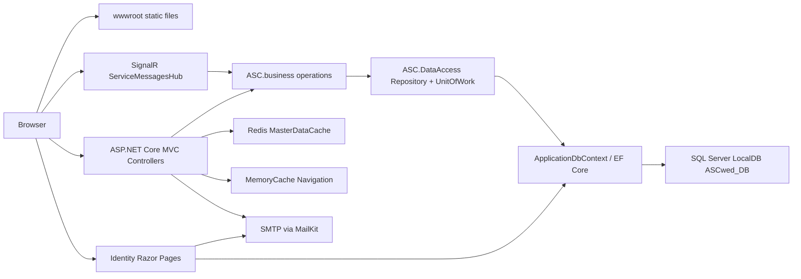
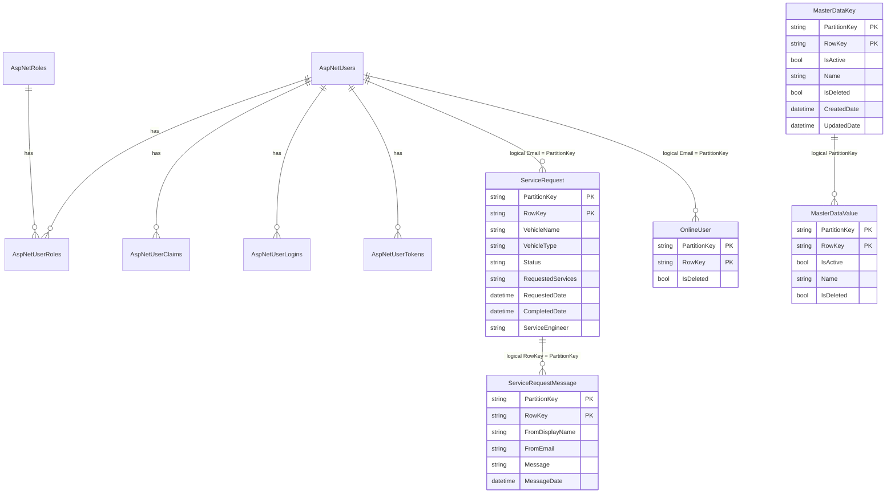
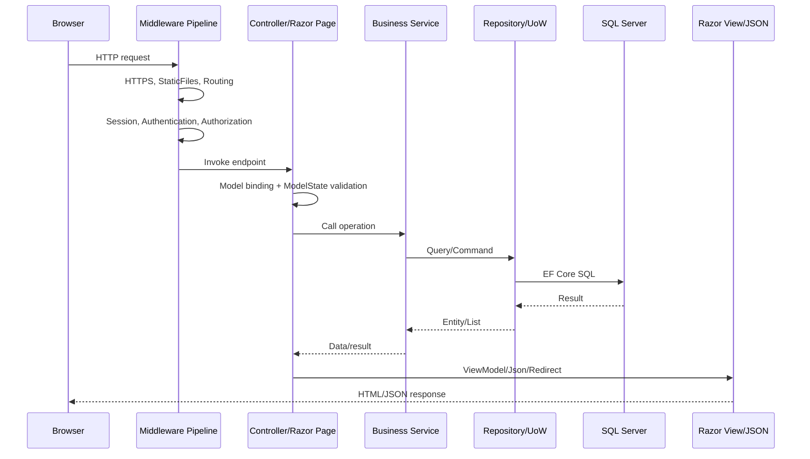
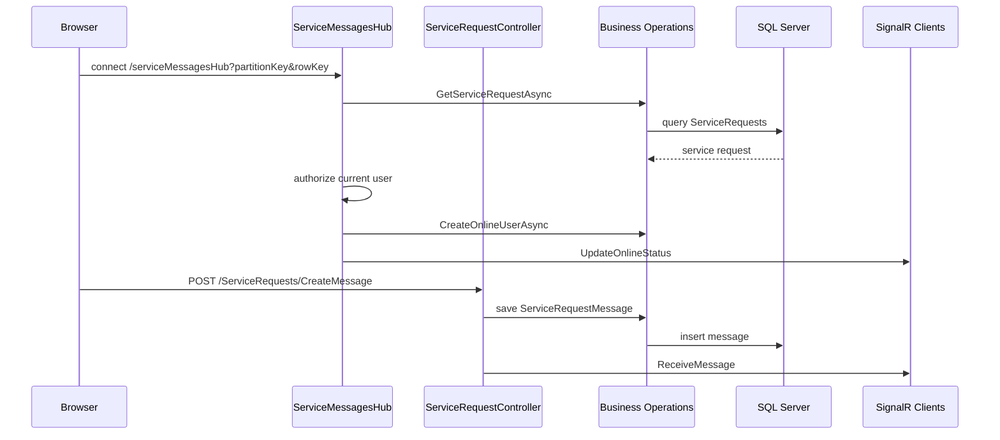

# Phân tích hệ thống web Automobile Service Center

## 1. TỔNG QUAN HỆ THỐNG

### Tên dự án

- Tên ứng dụng trong cấu hình: **Automobile Service Center**.
- Solution: `ASCsolution.slnx`.
- Web project chính: `ASCwed`.
- Các project hỗ trợ:
  - `ASC.Model`: entity/domain model.
  - `ASC.DataAccess`: Repository và Unit of Work.
  - `ASC.business`: business operations.
  - `ASC.Utilities`: extension/helper dùng chung.
  - `ASC.Tests`: xUnit test project.

### Mục đích

Hệ thống quản lý yêu cầu dịch vụ cho trung tâm sửa chữa/bảo dưỡng ô tô. Người dùng có thể đăng nhập, tạo yêu cầu dịch vụ, xem dashboard và trao đổi tin nhắn realtime trong từng yêu cầu. Admin quản lý master data, khách hàng và kỹ thuật viên.

### Chức năng chính

- Đăng nhập/đăng xuất bằng ASP.NET Core Identity.
- Đăng nhập ngoài qua Google OAuth.
- Reset password qua email.
- Quản lý role: `Admin`, `Engineer`, `User`.
- Admin quản lý khách hàng và kỹ thuật viên.
- Admin quản lý master data: `VehicleName`, `VehicleType`.
- Import master data từ Excel bằng EPPlus.
- Người dùng tạo service request.
- Dashboard service request theo role.
- Trang chi tiết service request kèm chat realtime bằng SignalR.
- Theo dõi trạng thái online của Admin/Engineer/Customer trong từng service request.
- Cache navigation bằng memory cache.
- Cache master data bằng Redis distributed cache.

### Tech stack

| Layer | Công nghệ |
|---|---|
| Backend | ASP.NET Core 8 MVC, Razor Pages, SignalR |
| Authentication | ASP.NET Core Identity, cookie authentication, Google OAuth |
| Database | SQL Server LocalDB qua EF Core |
| ORM | Entity Framework Core 8 |
| Cache | Redis distributed cache, ASP.NET Core MemoryCache |
| Frontend | Razor Views, Razor Pages, jQuery, Materialize CSS, Bootstrap assets, DataTables |
| Email | MailKit + MimeKit, SMTP Gmail |
| Excel import | EPPlus |
| Mapping | AutoMapper |
| Tests | xUnit, Moq, coverlet |

Ví dụ cấu hình tech stack nằm ở `ASCwed/ASCwed.csproj`:

```xml
<TargetFramework>net8.0</TargetFramework>
<PackageReference Include="Microsoft.AspNetCore.Identity.EntityFrameworkCore" Version="8.0.23" />
<PackageReference Include="Microsoft.EntityFrameworkCore.SqlServer" Version="8.0.23" />
<PackageReference Include="Microsoft.Extensions.Caching.StackExchangeRedis" Version="8.0.23" />
<PackageReference Include="Microsoft.AspNetCore.Authentication.Google" Version="8.0.26" />
<PackageReference Include="MailKit" Version="4.16.0" />
<PackageReference Include="EPPlus" Version="8.0.2" />
```

### Kiến trúc tổng thể

Hệ thống là **monolithic layered MVC application**:

- Một web app ASP.NET Core duy nhất chạy UI, routing, authentication và SignalR.
- Code chia theo layer/project:
  - Presentation: `ASCwed`.
  - Business: `ASC.business`.
  - Data access: `ASC.DataAccess`.
  - Domain model: `ASC.Model`.
  - Shared utilities: `ASC.Utilities`.
- Không phải microservices vì không có service độc lập, message broker, API gateway hay deployment riêng cho từng module.
- MVC truyền thống kết hợp Razor Pages cho Identity.
- Pattern đáng chú ý:
  - MVC.
  - Repository.
  - Unit of Work.
  - Dependency Injection.
  - Options pattern.
  - ViewComponent.
  - Cache-aside/warm cache.
  - SignalR Hub.

Luồng bootstrap chính ở `ASCwed/Program.cs`:

```csharp
builder.Services.AddMyDependencyGroup(builder.Configuration);
var app = builder.Build();
app.UseSession();
app.UseAuthentication();
app.UseAuthorization();
app.MapHub<ServiceMessagesHub>("/serviceMessagesHub");
app.MapControllerRoute(name: "areas", pattern: "{area:exists}/{controller=Home}/{action=Index}/{id?}");
app.MapControllerRoute(name: "default", pattern: "{controller=Home}/{action=Index}/{id?}");
app.MapRazorPages();
app.Run();
```

## 2. CẤU TRÚC THƯ MỤC & FILE

### Cây thư mục nguồn

Ghi chú: các thư mục generated/build như `.git`, `.vs`, `bin`, `obj`, `.dotnet-home`, `.codex_tmp` không nên xem là source chính nên được lược khỏi cây dưới đây.

```text
Nh-m-Tan_Hung_Tung-main/
├── .github/
├── .gitignore
├── ASCsolution.slnx
├── README.md
├── read_docx.ps1
├── LAB7. Service Request Management_Final (1).docx
├── ASC.Model/
│   ├── ASC.Model.csproj
│   ├── BaseTypes/
│   │   ├── BaseEntity.cs
│   │   ├── Constants .cs
│   │   └── IAuditTracker.cs
│   ├── Models/
│   │   ├── MasterDataKey.cs
│   │   ├── MasterDataValue.cs
│   │   ├── OnlineUser.cs
│   │   ├── ServiceRequest.cs
│   │   └── ServiceRequestMessage.cs
│   └── Queries/
│       └── Queries.cs
├── ASC.DataAccess/
│   ├── ASC.DataAccess.csproj
│   ├── Repository.cs
│   ├── UnitOfWork.cs
│   └── Interfaces/
│       ├── Irepository.cs
│       └── IunitOfWork.cs
├── ASC.business/
│   ├── ASC.business.csproj
│   ├── Class1.cs
│   ├── MasterDataOperations.cs
│   ├── OnlineUsersOperations.cs
│   ├── ServiceRequestMessageOperations.cs
│   ├── ServiceRequestOperations.cs
│   └── Interfaces/
│       ├── IMasterDataOperations.cs
│       ├── IOnlineUsersOperations.cs
│       ├── IServiceRequestMessageOperations.cs
│       └── IServiceRequestOperations.cs
├── ASC.Utilities/
│   ├── ASC.Utilities.csproj
│   ├── Class1.cs
│   ├── PredicateBuilder.cs
│   ├── Extensions/
│   │   ├── ClaimsPrincipalExtensions.cs
│   │   └── SessionExtensions.cs
│   └── Models/
│       ├── CurrentUser.cs
│       └── SessionConstants.cs
├── ASC.Tests/
│   ├── ASC.Tests.csproj
│   ├── FakeSession.cs
│   └── HomeControllerTests.cs
└── ASCwed/
    ├── ASCwed.csproj
    ├── ASCwed.csproj.user
    ├── Program.cs
    ├── DependencyInjection.cs
    ├── Navigation.json
    ├── appsettings.json
    ├── appsettings.Development.json
    ├── appsettings.Production.json
    ├── Areas/
    │   ├── _ViewImports.cshtml
    │   ├── Accounts/
    │   │   ├── Controllers/AccountController.cs
    │   │   ├── Models/
    │   │   │   ├── CustomerViewModel.cs
    │   │   │   ├── ProfileViewModel.cs
    │   │   │   └── ServiceEngineerViewModel.cs
    │   │   └── Views/Account/
    │   │       ├── Customers.cshtml
    │   │       ├── Profile.cshtml
    │   │       └── ServiceEngineers.cshtml
    │   ├── Configuration/
    │   │   ├── Controllers/MasterDataController.cs
    │   │   ├── Models/
    │   │   │   ├── MappingProfile.cs
    │   │   │   ├── MasterDataKeyViewModel.cs
    │   │   │   ├── MasterDataValueViewModel.cs
    │   │   │   ├── MasterKeysViewModel.cs
    │   │   │   └── MasterValuesViewModel.cs
    │   │   └── Views/MasterData/
    │   │       ├── MasterKeys.cshtml
    │   │       └── MasterValues.cshtml
    │   ├── Identity/
    │   │   └── Pages/Account/
    │   │       ├── AccessDenied.cshtml(.cs)
    │   │       ├── ExternalLogin.cshtml(.cs)
    │   │       ├── ForgotPassword.cshtml(.cs)
    │   │       ├── InitiateResetPassword.cshtml(.cs)
    │   │       ├── Login.cshtml(.cs)
    │   │       ├── Logout.cshtml(.cs)
    │   │       ├── ResetPassword.cshtml(.cs)
    │   │       └── ResetPasswordEmailConfirmation.cshtml(.cs)
    │   └── ServiceRequests/
    │       ├── Controllers/
    │       │   ├── DashboardController.cs
    │       │   └── ServiceRequestController.cs
    │       ├── Models/
    │       │   ├── DashboardViewModel.cs
    │       │   ├── NewServiceRequestViewModel.cs
    │       │   ├── ServiceRequestDetailsViewModel.cs
    │       │   └── ServiceRequestMappingProfile.cs
    │       └── Views/
    │           ├── Dashboard/Dashboard.cshtml
    │           ├── ServiceRequest/
    │           │   ├── ServiceRequest.cshtml
    │           │   └── ServiceRequestDetails.cshtml
    │           └── Shared/_ServiceRequestGrid.cshtml
    ├── Cofiguration/ApplicationSettings.cs
    ├── Controllers/
    │   ├── AnonymousController.cs
    │   ├── BaseController.cs
    │   └── HomeController.cs
    ├── Data/
    │   ├── ApplicationDbContext.cs
    │   ├── ApplicationDbContextFactory.cs
    │   ├── IdentitySeed.cs
    │   ├── IIdentitySeed.cs
    │   └── Migrations/
    ├── Models/
    │   ├── ErrorViewModel.cs
    │   └── Navigation/
    ├── Properties/
    ├── ServiceHub/ServiceMessagesHub.cs
    ├── Services/
    │   ├── AuthMessageSender.cs
    │   ├── IEmailSender.cs
    │   ├── ISmsSender.cs
    │   ├── MasterData/
    │   └── Navigation/
    ├── ViewComponents/LeftNavigationViewComponent.cs
    ├── Views/
    │   ├── _ViewImports.cshtml
    │   ├── _ViewStart.cshtml
    │   ├── Home/
    │   └── Shared/
    └── wwwroot/
        ├── css/
        ├── images/
        ├── js/
        └── lib/    # bootstrap, jquery, jquery-validation
```

### Vai trò folder/file quan trọng

| Đường dẫn | Vai trò |
|---|---|
| `ASCwed/Program.cs` | Entry point, cấu hình middleware pipeline, routes, SignalR hub, seeding và warm cache. |
| `ASCwed/DependencyInjection.cs` | Đăng ký DbContext, Identity, Google auth, MVC, Razor Pages, Redis, Session, DI cho business/data services. |
| `ASCwed/Data/ApplicationDbContext.cs` | EF Core DbContext, kế thừa `IdentityDbContext`, khai báo DbSet nghiệp vụ. |
| `ASCwed/Data/Migrations/` | Migration tạo bảng Identity và bảng nghiệp vụ. |
| `ASCwed/Areas/` | Chia module theo area: Accounts, Configuration, Identity, ServiceRequests. |
| `ASCwed/Controllers/` | Controller cấp root: Home, BaseController, AnonymousController. |
| `ASCwed/Views/` | Razor views/layout chung. |
| `ASCwed/wwwroot/` | Static assets: CSS, JS, image, frontend libraries. |
| `ASCwed/Navigation.json` | Cấu hình menu trái theo role. |
| `ASC.Model/Models/` | Entity nghiệp vụ dùng bởi EF Core. |
| `ASC.business/` | Use case/business operation: master data, service request, message, online user. |
| `ASC.DataAccess/` | Repository generic và UnitOfWork. |
| `ASC.Utilities/Extensions/` | Helper đọc claims và serialize object vào session. |
| `ASC.Tests/` | Unit test hiện có. |

### File config

- `ASCwed/appsettings.json`
  - `AppSettings`: tên ứng dụng, tài khoản seed, SMTP, roles.
  - `ConnectionStrings:DefaultConnection`: SQL Server LocalDB database `ASCwed_DB`.
  - `CacheSettings`: Redis `127.0.0.1:6379`, instance `ASCInstance`.
  - `Google:Identity`: Google OAuth client id/secret.
- `ASCwed/appsettings.Development.json`, `ASCwed/appsettings.Production.json`: cấu hình theo environment.
- `ASCwed/Properties/launchSettings.json`: profile chạy local.
- `ASCwed/Navigation.json`: menu theo role.

Lưu ý bảo mật: `appsettings.json` hiện chứa thông tin nhạy cảm như mật khẩu seed user, SMTP account và Google client secret. Trong dự án thực tế nên chuyển sang user-secrets, environment variables hoặc secret manager.

### Entry point

Entry point là `ASCwed/Program.cs`. File này:

1. Tạo `WebApplicationBuilder`.
2. Gọi `AddMyDependencyGroup`.
3. Seed role/user qua `IIdentitySeed`.
4. Warm navigation cache và master data cache.
5. Cấu hình middleware.
6. Map MVC routes, SignalR hub, Razor Pages.

### File routes

Route không nằm trong file riêng mà được map trong `ASCwed/Program.cs`:

```csharp
app.MapControllerRoute(
    name: "areas",
    pattern: "{area:exists}/{controller=Home}/{action=Index}/{id?}");

app.MapControllerRoute(
    name: "default",
    pattern: "{controller=Home}/{action=Index}/{id?}");

app.MapRazorPages();
```

Riêng action `CreateMessage` có route attribute:

```csharp
[HttpPost("/ServiceRequests/CreateMessage")]
public async Task<IActionResult> CreateMessage(...)
```

SignalR hub route:

```csharp
app.MapHub<ServiceMessagesHub>("/serviceMessagesHub");
```

## 3. KIẾN TRÚC MVC / DESIGN PATTERN

### Model

Các entity nghiệp vụ trong `ASC.Model/Models` đều kế thừa `BaseEntity`.

`BaseEntity` có khóa kép và audit fields:

```csharp
public class BaseEntity
{
    public string PartitionKey { get; set; }
    public string RowKey { get; set; }
    public bool IsDeleted { get; set; }
    public DateTime CreatedDate { get; set; }
    public DateTime UpdatedDate { get; set; }
    public string CreatedBy { get; set; }
    public string UpdatedBy { get; set; }
}
```

Các entity:

| Entity | Table | Ý nghĩa |
|---|---|---|
| `MasterDataKey` | `MasterDataKeys` | Nhóm master data, ví dụ `VehicleName`, `VehicleType`. |
| `MasterDataValue` | `MasterDataValues` | Giá trị thuộc một master key. |
| `ServiceRequest` | `ServiceRequests` | Yêu cầu dịch vụ của khách hàng. |
| `ServiceRequestMessage` | `ServiceRequestMessages` | Tin nhắn chat trong service request. |
| `OnlineUser` | `OnlineUsers` | Trạng thái online/offline logic theo email. |
| `IdentityUser`, `IdentityRole` | `AspNetUsers`, `AspNetRoles`, ... | Bảng Identity mặc định. |

Quan hệ nghiệp vụ:

- `MasterDataKey` 1-n `MasterDataValue` theo logic `MasterDataKey.PartitionKey == MasterDataValue.PartitionKey`.
- `IdentityUser` 1-n `ServiceRequest` theo logic `AspNetUsers.Email == ServiceRequest.PartitionKey`.
- `ServiceRequest` 1-n `ServiceRequestMessage` theo logic `ServiceRequest.RowKey == ServiceRequestMessage.PartitionKey`.
- `IdentityUser` 1-n `OnlineUser` theo logic `AspNetUsers.Email == OnlineUser.PartitionKey`.
- `IdentityUser` n-n `IdentityRole` qua bảng `AspNetUserRoles` do Identity tạo.

Điểm quan trọng: các quan hệ nghiệp vụ trên **không được khai báo foreign key trong EF Core**. `ApplicationDbContext.OnModelCreating` chỉ cấu hình composite primary key:

```csharp
builder.Entity<ServiceRequest>()
    .HasKey(c => new { c.PartitionKey, c.RowKey });
```

### View

View engine là **Razor**:

- MVC views: `ASCwed/Views`, `ASCwed/Areas/*/Views`.
- Identity pages: `ASCwed/Areas/Identity/Pages`.
- Layout public: `Views/Shared/_Layout.cshtml`.
- Layout secure: `Views/Shared/_SecureLayout.cshtml`.
- Layout master HTML: `Views/Shared/_MasterLayout.cshtml`.
- Menu trái: `LeftNavigationViewComponent` render `Views/Shared/Components/LeftNavigation/Default.cshtml`.

Ví dụ `Areas/ServiceRequests/Views/_ViewStart.cshtml` dùng secure layout:

```csharp
@{
    Layout = "/Views/Shared/_SecureLayout.cshtml";
}
```

### Controller

Các controller chính:

| Controller/PageModel | Vai trò |
|---|---|
| `HomeController` | Trang public Home, Privacy, Error. |
| `AccountController` | Quản lý profile, customers, service engineers. |
| `MasterDataController` | CRUD master keys/values, import Excel. |
| `DashboardController` | Dashboard service requests theo role. |
| `ServiceRequestController` | Tạo service request, xem chi tiết, lấy/gửi message. |
| `LoginModel`, `ExternalLoginModel`, ... | Identity Razor Pages cho auth. |
| `ServiceMessagesHub` | SignalR realtime hub. |

`BaseController` áp dụng `[Authorize]` cho controller kế thừa:

```csharp
[Authorize]
public abstract class BaseController : Controller
{
}
```

`AnonymousController` áp dụng `[AllowAnonymous]`:

```csharp
[AllowAnonymous]
public abstract class AnonymousController : Controller
{
}
```

### Request flow tổng quát

Ví dụ tạo service request:

1. User mở `GET /ServiceRequests/ServiceRequest/ServiceRequest`.
2. `ServiceRequestController.ServiceRequest()` gọi `PopulateMasterDataAsync`.
3. Master data được lấy từ Redis cache qua `IMasterDataCacheOperations`.
4. Razor view render form chọn vehicle name/type.
5. User submit `POST /ServiceRequests/ServiceRequest/ServiceRequest`.
6. Controller validate `NewServiceRequestViewModel`.
7. AutoMapper map view model sang `ServiceRequest`.
8. Controller set `PartitionKey = currentUser.Email`, `RowKey = Guid.NewGuid()`, `Status = New`.
9. Business layer `ServiceRequestOperations.CreateServiceRequestAsync`.
10. Repository add entity, UnitOfWork commit.
11. Redirect về dashboard.

## 4. DATABASE & DATA FLOW

### DbContext

`ASCwed/Data/ApplicationDbContext.cs`:

```csharp
public class ApplicationDbContext : IdentityDbContext
{
    public virtual DbSet<MasterDataKey> MasterDataKeys { get; set; }
    public virtual DbSet<MasterDataValue> MasterDataValues { get; set; }
    public virtual DbSet<ServiceRequest> ServiceRequests { get; set; }
    public virtual DbSet<ServiceRequestMessage> ServiceRequestMessages { get; set; }
    public virtual DbSet<OnlineUser> OnlineUsers { get; set; }
}
```

Database dùng SQL Server LocalDB:

```json
"DefaultConnection": "Server=(localdb)\\MSSQLLocalDB;Database=ASCwed_DB;Trusted_Connection=True;MultipleActiveResultSets=true"
```

### Bảng nghiệp vụ

#### `MasterDataKeys`

| Column | Kiểu logic | Ghi chú |
|---|---|---|
| `PartitionKey` | string | Một phần khóa chính; thường là tên key, ví dụ `VehicleName`. |
| `RowKey` | string | Một phần khóa chính; GUID. |
| `IsActive` | bool | Có dùng hay không. |
| `Name` | string | Tên hiển thị/key name. |
| `IsDeleted` | bool | Soft delete flag theo model. |
| `CreatedDate`, `UpdatedDate` | DateTime | Audit. |
| `CreatedBy`, `UpdatedBy` | string | Audit user. |

Primary key: `(PartitionKey, RowKey)`.

#### `MasterDataValues`

| Column | Kiểu logic | Ghi chú |
|---|---|---|
| `PartitionKey` | string | Master key mà value thuộc về. |
| `RowKey` | string | GUID value id. |
| `IsActive` | bool | Có dùng hay không. |
| `Name` | string | Giá trị hiển thị. |
| Audit columns | | Kế thừa `BaseEntity`. |

Primary key: `(PartitionKey, RowKey)`.

Quan hệ logic: nhiều `MasterDataValue` thuộc một `MasterDataKey` qua `PartitionKey`.

#### `ServiceRequests`

| Column | Kiểu logic | Ghi chú |
|---|---|---|
| `PartitionKey` | string | Email khách hàng tạo request. |
| `RowKey` | string | GUID của request. |
| `VehicleName` | string | RowKey của master value vehicle name được chọn từ form. |
| `VehicleType` | string | RowKey của master value vehicle type được chọn từ form. |
| `Status` | string | Trạng thái: `New`, `InProgress`, ... |
| `RequestedServices` | string | Nội dung yêu cầu. |
| `RequestedDate` | DateTime? | Ngày yêu cầu. |
| `CompletedDate` | DateTime? | Ngày hoàn thành. |
| `ServiceEngineer` | string | Email kỹ thuật viên phụ trách, có thể rỗng. |
| Audit columns | | Kế thừa `BaseEntity`. |

Primary key: `(PartitionKey, RowKey)`.

#### `ServiceRequestMessages`

| Column | Kiểu logic | Ghi chú |
|---|---|---|
| `PartitionKey` | string | `RowKey` của service request. |
| `RowKey` | string | GUID của message. |
| `FromDisplayName` | string | Tên người gửi. |
| `FromEmail` | string | Email người gửi. |
| `Message` | string | Nội dung chat. |
| `MessageDate` | DateTime? | Thời điểm gửi. |
| Audit columns | | Kế thừa `BaseEntity`. |

Primary key: `(PartitionKey, RowKey)`.

Quan hệ logic: nhiều message thuộc một service request qua `ServiceRequestMessages.PartitionKey == ServiceRequests.RowKey`.

#### `OnlineUsers`

| Column | Kiểu logic | Ghi chú |
|---|---|---|
| `PartitionKey` | string | Email user. |
| `RowKey` | string | GUID record. |
| `IsDeleted` | bool | `false` nghĩa là online, `true` nghĩa là offline. |
| Audit columns | | Kế thừa `BaseEntity`. |

### Bảng Identity

Migration `00000000000000_CreateIdentitySchema.cs` tạo:

| Table | Vai trò |
|---|---|
| `AspNetUsers` | User account. |
| `AspNetRoles` | Role. |
| `AspNetUserRoles` | Mapping n-n user-role. |
| `AspNetUserClaims` | Claim của user, ví dụ email claim và `IsActive`. |
| `AspNetRoleClaims` | Claim của role. |
| `AspNetUserLogins` | External login provider như Google. |
| `AspNetUserTokens` | Token Identity. |

### Data flow DB -> Backend -> Frontend

Ví dụ dashboard:

```text
Browser
  -> GET /ServiceRequests/Dashboard/Dashboard
  -> DashboardController.Dashboard()
  -> User.ToCurrentUser()
  -> IServiceRequestOperations.GetServiceRequestsByRequestedDateAndStatus(...)
  -> Queries.GetDashboardQuery(...)
  -> UnitOfWork.Repository<ServiceRequest>().FindAllByQuery(...)
  -> EF Core SQL Server
  -> DashboardViewModel
  -> Dashboard.cshtml
  -> _ServiceRequestGrid.cshtml
  -> HTML + DataTables
```

Ví dụ master data cho dropdown:

```text
Startup
  -> MasterDataCacheOperations.CreateMasterDataCacheAsync()
  -> MasterDataOperations.GetAllMasterKeysAsync/GetAllMasterValuesAsync()
  -> SQL Server
  -> Redis key "MasterDataCache"

Request tạo service request
  -> ServiceRequestController.PopulateMasterDataAsync()
  -> GetMasterDataCacheAsync()
  -> ViewBag.VehicleTypes/VehicleNames
  -> Razor select list
```

## 5. QUY TRÌNH XỬ LÝ REQUEST (Request Lifecycle)

### Middleware pipeline thực tế

Trong `Program.cs`:

```csharp
app.UseHttpsRedirection();
app.UseStaticFiles();
app.UseRouting();
app.UseSession();
app.UseAuthentication();
app.UseAuthorization();
app.MapHub<ServiceMessagesHub>("/serviceMessagesHub");
app.MapControllerRoute(...);
app.MapRazorPages();
```

Thứ tự xử lý:

1. Browser gửi HTTP request.
2. HTTPS redirection nếu cần.
3. Static files nếu request vào `wwwroot`.
4. Routing chọn endpoint.
5. Session middleware load session cookie `.ASCwed.Session`.
6. Authentication middleware đọc Identity cookie và tạo `HttpContext.User`.
7. Authorization kiểm tra `[Authorize]`, role và policy mặc định.
8. MVC/Razor Page/SignalR endpoint được gọi.
9. Controller/PageModel nhận model binding, validate `ModelState`.
10. Controller gọi business layer.
11. Business layer gọi UnitOfWork/Repository.
12. Repository gọi EF Core DbContext.
13. SQL Server trả data.
14. Controller trả `View`, `Json`, `Redirect`, `NotFound`.
15. Razor render HTML hoặc JSON trả về browser.

### Lifecycle ví dụ: tạo service request

```text
Browser POST form
  -> /ServiceRequests/ServiceRequest/ServiceRequest
  -> UseRouting
  -> UseSession
  -> UseAuthentication
  -> UseAuthorization
  -> ServiceRequestController.ServiceRequest(NewServiceRequestViewModel)
  -> NormalizeRequestedDate(dd/MM/yyyy)
  -> ModelState validation
  -> User.ToCurrentUser()
  -> AutoMapper map ViewModel -> ServiceRequest
  -> set PartitionKey/RowKey/Status/Audit fields
  -> ServiceRequestOperations.CreateServiceRequestAsync()
  -> Repository<ServiceRequest>.AddAsync()
  -> UnitOfWork.CommitTransaction()
  -> SQL Server INSERT
  -> RedirectToAction Dashboard
```

### Lifecycle ví dụ: chat realtime

```text
Browser mở ServiceRequestDetails.cshtml
  -> JS tạo SignalR connection tới /serviceMessagesHub?partitionKey=...&rowKey=...
  -> ServiceMessagesHub.OnConnectedAsync()
  -> kiểm tra partitionKey/rowKey
  -> load ServiceRequest
  -> kiểm tra quyền truy cập
  -> add connection vào group service-request:{partition}:{row}
  -> OnlineUsersOperations.CreateOnlineUserAsync(email)
  -> Clients.Group(...).SendAsync("UpdateOnlineStatus", ...)

User bấm Enter gửi message
  -> fetch POST /ServiceRequests/CreateMessage
  -> ValidateAntiForgeryToken
  -> ServiceRequestController.CreateMessage()
  -> kiểm tra quyền truy cập
  -> lưu ServiceRequestMessage
  -> Clients.Users(recipients).SendAsync("ReceiveMessage", message)
```

## 6. HỆ THỐNG AUTHENTICATION & AUTHORIZATION

### Authentication

Hệ thống dùng **ASP.NET Core Identity cookie authentication**, không dùng JWT.

Đăng ký Identity trong `DependencyInjection.cs`:

```csharp
services.AddIdentity<IdentityUser, IdentityRole>(options =>
{
    options.User.RequireUniqueEmail = true;
    options.SignIn.RequireConfirmedAccount = true;
    options.Password.RequireDigit = true;
    options.Password.RequireLowercase = true;
    options.Password.RequireUppercase = false;
    options.Password.RequireNonAlphanumeric = false;
    options.Password.RequiredLength = 6;
})
.AddEntityFrameworkStores<ApplicationDbContext>()
.AddDefaultTokenProviders();
```

Cookie path:

```csharp
options.LoginPath = "/Identity/Account/Login";
options.AccessDeniedPath = "/Identity/Account/AccessDenied";
options.LogoutPath = "/Identity/Account/Logout";
options.SlidingExpiration = true;
```

Session cũng được dùng:

```csharp
services.AddSession(options =>
{
    options.Cookie.HttpOnly = true;
    options.Cookie.IsEssential = true;
    options.Cookie.Name = ".ASCwed.Session";
    options.IdleTimeout = TimeSpan.FromMinutes(30);
});
```

Session không thay thế Identity cookie. Session chủ yếu lưu `CurrentUser` và dữ liệu phụ như `MasterKeys`.

### Đăng nhập

`Areas/Identity/Pages/Account/Login.cshtml.cs`:

1. User nhập email/password.
2. `UserManager.FindByEmailAsync(Input.Email)` tìm user.
3. `SignInManager.PasswordSignInAsync(user.UserName, Input.Password, Input.RememberMe, false)` xác thực.
4. Nếu thành công:
   - Lấy roles.
   - Tạo `CurrentUser`.
   - Lưu vào session với key `CurrentUser`.
   - Redirect `/ServiceRequests/Dashboard/Dashboard`.

Code ví dụ:

```csharp
var result = await _signInManager.PasswordSignInAsync(
    user.UserName ?? Input.Email,
    Input.Password,
    Input.RememberMe,
    lockoutOnFailure: false);

HttpContext.Session.SetObjectAsJson(SessionConstants.CurrentUser, currentUser);
return Redirect("/ServiceRequests/Dashboard/Dashboard");
```

### Đăng xuất

`Logout.cshtml.cs`:

```csharp
HttpContext.Session.Clear();
await _signInManager.SignOutAsync();
return Redirect("/");
```

### Google external login

Đăng ký Google trong DI:

```csharp
services.AddAuthentication()
    .AddGoogle(options =>
    {
        options.ClientId = configuration["Google:Identity:ClientId"]!;
        options.ClientSecret = configuration["Google:Identity:ClientSecret"]!;
    });
```

`ExternalLoginModel` xử lý:

- Challenge sang Google.
- Callback nhận external login info.
- Nếu user đã liên kết provider thì đăng nhập.
- Nếu chưa có tài khoản thì tạo `IdentityUser`, add role `User`, add claims rồi `AddLoginAsync`.

### Reset password

- `ForgotPassword.cshtml.cs`: nhận email, tạo token bằng `GeneratePasswordResetTokenAsync`, encode Base64 URL, gửi email.
- `ResetPassword.cshtml.cs`: decode token, gọi `ResetPasswordAsync`.
- `InitiateResetPassword.cshtml.cs`: user đã đăng nhập tự gửi email reset mật khẩu cho chính mình.

### Authorization

Role được định nghĩa ở `ASC.Model/BaseTypes/Constants .cs`:

```csharp
public enum Roles
{
    Admin, Engineer, User
}
```

Các chỗ phân quyền:

- `BaseController` yêu cầu authenticated user.
- `MasterDataController` yêu cầu `[Authorize(Roles = "Admin")]`.
- `AccountController.ServiceEngineers`, `Customers`, update user yêu cầu `[Authorize(Roles = "Admin")]`.
- Dashboard lọc data theo role:
  - Admin: tất cả request gần 7 ngày theo trạng thái chính.
  - Engineer: request gần 7 ngày được assign cho email engineer.
  - User: request của chính email user trong 1 năm.
- Detail/chat kiểm tra quyền truy cập thủ công:
  - Admin email trong config.
  - Customer email bằng `ServiceRequest.PartitionKey`.
  - Engineer email bằng `ServiceRequest.ServiceEngineer`.

Code kiểm tra access trong `ServiceRequestController`:

```csharp
return IsSameEmail(currentUser.Email, adminEmail)
    || IsSameEmail(currentUser.Email, serviceRequest.PartitionKey)
    || IsSameEmail(currentUser.Email, serviceRequest.ServiceEngineer);
```

### Seeding role/user

`Program.cs` gọi `IIdentitySeed.Seed(...)`. `IdentitySeed.cs` tạo role từ cấu hình:

```json
"Roles": "Admin,User,Engineer"
```

Sau đó tạo seed users:

- Admin.
- Engineer.
- User.

Mỗi user được add email claim và claim `IsActive`.

## 7. API ENDPOINTS

Hệ thống chủ yếu là MVC page endpoints và một số JSON/AJAX endpoints, không phải REST API thuần.

### Root/Home

| Method | URL | Handler | Chức năng | Params |
|---|---|---|---|---|
| GET | `/` | `HomeController.Index` | Trang public home. | - |
| GET | `/Home/Index` | `HomeController.Index` | Trang public home. | - |
| GET | `/Home/Privacy` | `HomeController.Privacy` | Trang privacy. | - |
| GET | `/Home/Error` | `HomeController.Error` | Trang lỗi. | - |

### Identity Razor Pages

| Method | URL | Handler | Chức năng | Params |
|---|---|---|---|---|
| GET | `/Identity/Account/Login` | `LoginModel.OnGetAsync` | Hiển thị form login, clear session/signout cũ. | `returnUrl`, `resetPasswordSuccess` |
| POST | `/Identity/Account/Login` | `LoginModel.OnPostAsync` | Login bằng email/password. | `Email`, `Password`, `RememberMe`, `returnUrl` |
| GET | `/Identity/Account/Logout` | `LogoutModel.OnGet` | Redirect về login. | - |
| POST | `/Identity/Account/Logout` | `LogoutModel.OnPost` | Logout, clear session. | `returnUrl` |
| GET | `/Identity/Account/ForgotPassword` | `ForgotPasswordModel.OnGet` | Form quên mật khẩu. | - |
| POST | `/Identity/Account/ForgotPassword` | `ForgotPasswordModel.OnPostAsync` | Gửi email reset password. | `Email` |
| GET | `/Identity/Account/ResetPassword` | `ResetPasswordModel.OnGet` | Form đặt lại mật khẩu. | `code`, `email` |
| POST | `/Identity/Account/ResetPassword` | `ResetPasswordModel.OnPostAsync` | Reset password bằng token. | `Email`, `Password`, `ConfirmPassword`, `Code` |
| POST | `/Identity/Account/InitiateResetPassword` | `InitiateResetPasswordModel.OnPostAsync` | User đang login yêu cầu reset password. | anti-forgery token |
| GET | `/Identity/Account/AccessDenied` | `AccessDeniedModel.OnGet` | Trang từ chối truy cập. | - |
| POST | `/Identity/Account/ExternalLogin` | `ExternalLoginModel.OnPost` | Challenge tới Google/provider. | `provider`, `returnUrl` |
| GET | `/Identity/Account/ExternalLogin?handler=Callback` | `ExternalLoginModel.OnGetCallbackAsync` | Callback từ provider. | `returnUrl`, `remoteError` |
| POST | `/Identity/Account/ExternalLogin?handler=Confirmation` | `ExternalLoginModel.OnPostConfirmationAsync` | Tạo account sau external login. | `Email`, `returnUrl` |

### Accounts area

| Method | URL | Handler | Chức năng | Params |
|---|---|---|---|---|
| GET | `/Accounts/Account/ServiceEngineers` | `AccountController.ServiceEngineers` | Admin xem danh sách engineer và form tạo engineer. | - |
| POST | `/Accounts/Account/ServiceEngineers` | `AccountController.ServiceEngineers` | Admin tạo engineer. | `Registration.UserName`, `Registration.Email`, `Registration.Password`, `Registration.ConfirmPassword`, `Registration.IsActive` |
| POST | `/Accounts/Account/UpdateServiceEngineer` | `AccountController.UpdateServiceEngineer` | Admin cập nhật email/trạng thái engineer. | `UserName`, `Email`, `IsActive` |
| GET | `/Accounts/Account/Customers` | `AccountController.Customers` | Admin xem customer. | - |
| POST | `/Accounts/Account/UpdateCustomer` | `AccountController.UpdateCustomer` | Admin cập nhật email/trạng thái customer. | `UserName`, `Email`, `IsActive` |
| GET | `/Accounts/Account/Profile` | `AccountController.Profile` | Xem profile user hiện tại. | - |
| POST | `/Accounts/Account/Profile` | `AccountController.Profile` | Cập nhật username. | `UserName` |
| GET | `/Accounts/Account/ExternalLogin` | `AccountController.ExternalLogin` | Trả view external login trong Accounts area. | - |

### Configuration area

| Method | URL | Handler | Chức năng | Params |
|---|---|---|---|---|
| GET | `/Configuration/MasterData/MasterKeys` | `MasterDataController.MasterKeys` | Xem master keys. | - |
| POST | `/Configuration/MasterData/MasterKeys` | `MasterDataController.MasterKeys` | Tạo/cập nhật master key qua AJAX. | `isEdit`, `RowKey`, `PartitionKey`, `Name`, `IsActive` |
| GET | `/Configuration/MasterData/MasterValues` | `MasterDataController.MasterValues` | Xem trang master values. | - |
| GET | `/Configuration/MasterData/MasterValuesByKey` | `MasterDataController.MasterValuesByKey` | Lấy values theo key dạng JSON. | `key` |
| POST | `/Configuration/MasterData/MasterValues` | `MasterDataController.MasterValues` | Tạo/cập nhật master value qua AJAX. | `isEdit`, `RowKey`, `PartitionKey`, `Name`, `IsActive` |
| POST | `/Configuration/MasterData/UploadExcel` | `MasterDataController.UploadExcel` | Import master data từ Excel. | file `files` |

### ServiceRequests area

| Method | URL | Handler | Chức năng | Params |
|---|---|---|---|---|
| GET | `/ServiceRequests/Dashboard/Dashboard` | `DashboardController.Dashboard` | Dashboard service requests theo role. | - |
| GET | `/ServiceRequests/ServiceRequest/ServiceRequest` | `ServiceRequestController.ServiceRequest` | Form tạo service request. | - |
| POST | `/ServiceRequests/ServiceRequest/ServiceRequest` | `ServiceRequestController.ServiceRequest` | Tạo service request. | `VehicleName`, `VehicleType`, `RequestedServices`, `RequestedDate` |
| GET | `/ServiceRequests/ServiceRequest/Details` | `ServiceRequestController.Details` | Xem chi tiết request và chat. | `partitionKey`, `rowKey` |
| GET | `/ServiceRequests/ServiceRequest/GetMessages` | `ServiceRequestController.GetMessages` | Lấy messages dạng JSON. | `rowKey` |
| POST | `/ServiceRequests/CreateMessage` | `ServiceRequestController.CreateMessage` | Tạo message và push SignalR. | `partitionKey`, `rowKey`, `message` |

### SignalR

| Method | URL | Handler | Chức năng | Params |
|---|---|---|---|---|
| WebSocket/HTTP | `/serviceMessagesHub` | `ServiceMessagesHub` | Realtime chat/status online. | query `partitionKey`, `rowKey` |

## 8. CÁC MODULE / TÍNH NĂNG CHÍNH

### Module Authentication/Identity

File liên quan:

- `ASCwed/DependencyInjection.cs`
- `ASCwed/Areas/Identity/Pages/Account/*.cshtml.cs`
- `ASCwed/Data/IdentitySeed.cs`
- `ASC.Utilities/Extensions/ClaimsPrincipalExtensions.cs`
- `ASC.Utilities/Extensions/SessionExtensions.cs`

Flow login:

```text
Login.cshtml
  -> LoginModel.OnPostAsync
  -> UserManager.FindByEmailAsync
  -> SignInManager.PasswordSignInAsync
  -> UserManager.GetRolesAsync
  -> Session.SetObjectAsJson("CurrentUser")
  -> Redirect dashboard
```

Điểm cần nhớ:

- Identity dùng cookie, không dùng JWT.
- User phải `EmailConfirmed = true`.
- Google external login tạo user mới với role `User`.
- Seed user tạo từ `AppSettings`.

### Module User Administration

File liên quan:

- `ASCwed/Areas/Accounts/Controllers/AccountController.cs`
- `ASCwed/Areas/Accounts/Models/ServiceEngineerViewModel.cs`
- `ASCwed/Areas/Accounts/Models/CustomerViewModel.cs`
- `ASCwed/Areas/Accounts/Views/Account/ServiceEngineers.cshtml`
- `ASCwed/Areas/Accounts/Views/Account/Customers.cshtml`

Chức năng:

- Admin xem danh sách engineer/customer.
- Admin tạo engineer.
- Admin cập nhật email và trạng thái active/inactive.
- Trạng thái active được biểu diễn bằng `LockoutEnd`:
  - Active: `LockoutEnd = null`, `LockoutEnabled = false`.
  - Inactive: `LockoutEnd = DateTimeOffset.MaxValue`, `LockoutEnabled = true`.
- Claim `IsActive` được cập nhật theo trạng thái.
- Gửi email thông báo khi tạo/cập nhật tài khoản.

### Module Profile

File liên quan:

- `AccountController.Profile`
- `ProfileViewModel.cs`
- `Profile.cshtml`

Chức năng:

- User xem email readonly.
- User đổi username.
- Backend kiểm tra username trùng bằng `UserManager.FindByNameAsync`.

### Module Master Data

File liên quan:

- `MasterDataController.cs`
- `MasterDataOperations.cs`
- `MasterDataKey.cs`, `MasterDataValue.cs`
- `MappingProfile.cs`
- `MasterKeys.cshtml`, `MasterValues.cshtml`
- `MasterDataCacheOperations.cs`

Chức năng:

- CRUD master keys.
- CRUD master values.
- Load values theo key qua AJAX.
- Import Excel với các cột `MasterKey`, `MasterValue`, `IsActive`.
- Cache master data active vào Redis.

Flow tạo master value:

```text
MasterValues.cshtml
  -> AJAX POST /Configuration/MasterData/MasterValues
  -> ValidateAntiForgeryToken
  -> ModelState.IsValid
  -> AutoMapper MasterDataValueViewModel -> MasterDataValue
  -> set audit fields
  -> MasterDataOperations.InsertMasterValueAsync/UpdateMasterValueAsync
  -> UnitOfWork.CommitTransaction
  -> Json(true)
```

Flow import Excel:

```text
UploadExcel()
  -> Request.Form.Files
  -> ParseMasterDataExcel(IFormFile)
  -> EPPlus đọc worksheet đầu tiên
  -> validate từng dòng
  -> UploadBulkMasterData(values)
  -> đảm bảo key tồn tại
  -> insert/update value
  -> commit
```

### Module Service Requests

File liên quan:

- `ServiceRequestController.cs`
- `DashboardController.cs`
- `ServiceRequestOperations.cs`
- `Queries.cs`
- `ServiceRequest.cs`
- `NewServiceRequestViewModel.cs`
- `Dashboard.cshtml`
- `_ServiceRequestGrid.cshtml`
- `ServiceRequest.cshtml`

Chức năng:

- Tạo service request mới.
- Dashboard lọc request theo role.
- Xem chi tiết request.
- Chuẩn hóa `RequestedDate` từ định dạng `dd/MM/yyyy`.

Flow dashboard theo role:

```csharp
if (User.IsInRole(Roles.Admin.ToString()))
{
    GetServiceRequestsByRequestedDateAndStatus(DateTime.UtcNow.AddDays(-7), status);
}
else if (User.IsInRole(Roles.Engineer.ToString()))
{
    GetServiceRequestsByRequestedDateAndStatus(..., serviceEngineerEmail: currentUser.Email);
}
else
{
    GetServiceRequestsByRequestedDateAndStatus(DateTime.UtcNow.AddYears(-1), email: currentUser.Email);
}
```

Trạng thái service request lấy từ enum:

```csharp
public enum Status
{
    New, Denied, Pending, Initiated, InProgress, PendingCustomerApproval,
    RequestForInformation, Completed
}
```

### Module Realtime Messaging

File liên quan:

- `ServiceMessagesHub.cs`
- `ServiceRequestController.CreateMessage`
- `ServiceRequestMessageOperations.cs`
- `OnlineUsersOperations.cs`
- `ServiceRequestDetails.cshtml`

Chức năng:

- User trong cùng service request nhận message realtime.
- Hiển thị trạng thái online/offline của Admin/Engineer/Customer.
- Kiểm tra quyền khi connect hub và khi gửi message.

Flow gửi message:

```text
User gõ message + Enter
  -> JS fetch POST /ServiceRequests/CreateMessage
  -> Controller validate partitionKey/rowKey/message
  -> kiểm tra serviceRequest tồn tại và quyền truy cập
  -> lưu ServiceRequestMessage
  -> tìm recipient user ids bằng email
  -> SignalR Clients.Users(recipients).SendAsync("ReceiveMessage", message)
```

### Module Navigation

File liên quan:

- `Navigation.json`
- `NavigationCacheOperations.cs`
- `LeftNavigationViewComponent.cs`
- `NavigationModels.cs`
- `Default.cshtml`

Chức năng:

- Menu trái cấu hình bằng JSON.
- Mỗi menu item có `UserRoles`.
- `NavigationCacheOperations` load JSON vào `IMemoryCache`.
- `LeftNavigationViewComponent` lọc menu theo role hiện tại.

Ví dụ item chỉ Admin thấy:

```json
{
  "DisplayName": "Master Data",
  "UserRoles": [ "Admin" ],
  "NestedItems": [...]
}
```

### Module Email

File liên quan:

- `AuthMessageSender.cs`
- `IEmailSender.cs`
- `ISmsSender.cs`
- `ApplicationSettings.cs`

Chức năng:

- Gửi email reset password.
- Gửi email welcome/notification khi Admin tạo/cập nhật account.
- Nếu SMTP thiếu cấu hình, log warning và bỏ qua gửi email.

## 9. XỬ LÝ LỖI & VALIDATION

### Validation backend

Hệ thống dùng Data Annotations trên ViewModel:

`NewServiceRequestViewModel.cs`:

```csharp
[Required]
[Display(Name = "Vehicle Name")]
public string VehicleName { get; set; } = string.Empty;
```

`ServiceEngineerRegistrationViewModel`:

```csharp
[Required]
[EmailAddress]
public string Email { get; set; } = string.Empty;

[StringLength(100, MinimumLength = 6)]
[DataType(DataType.Password)]
public string Password { get; set; } = string.Empty;

[Compare("Password")]
public string ConfirmPassword { get; set; } = string.Empty;
```

Controller kiểm tra `ModelState.IsValid`:

```csharp
if (!ModelState.IsValid)
{
    await PopulateMasterDataAsync();
    return View(request);
}
```

### Validation frontend

View dùng:

- Tag Helper `asp-validation-for`.
- Partial `_ValidationScriptsPartial`.
- jQuery validation/unobtrusive validation.
- Materialize required/select handling.

Ví dụ `ServiceRequest.cshtml`:

```html
<span asp-validation-for="VehicleName" class="helper-text red-text"></span>
<partial name="_ValidationScriptsPartial" />
```

AJAX form ở Master Data gọi `form.valid()` trước khi POST.

### Anti-forgery

Các POST form/controller quan trọng dùng `[ValidateAntiForgeryToken]`.

Ví dụ:

```csharp
[HttpPost]
[ValidateAntiForgeryToken]
public async Task<IActionResult> MasterValues(...)
```

AJAX/fetch gửi token từ hidden input:

```javascript
body.append('__RequestVerificationToken', token);
headers: { 'RequestVerificationToken': token }
```

### Xử lý lỗi

Các cơ chế lỗi:

- Production dùng `app.UseExceptionHandler("/Home/Error")`.
- Development dùng `app.UseMigrationsEndPoint()`.
- Controller trả:
  - `View(model)` với `ModelState` khi input invalid.
  - `Json(false)` hoặc `Json(new { Error = true, Text = ... })` cho AJAX.
  - `NotFound()` khi không có quyền hoặc không tìm thấy service request.
  - `TempData["Success"]`, `TempData["Error"]` cho thông báo redirect.
- Email sending được bọc `try/catch` trong account admin operations để không làm fail luồng chính.
- Import Excel catch `InvalidDataException` để trả lỗi dòng cụ thể.

Ví dụ import Excel:

```csharp
catch (InvalidDataException ex)
{
    return Json(new { Error = true, Text = ex.Message });
}
catch (Exception ex)
{
    return Json(new { Error = true, Text = $"Cannot import Excel file. {ex.Message}" });
}
```

### Có middleware xử lý exception không?

Có, nhưng chỉ ở production:

```csharp
app.UseExceptionHandler("/Home/Error");
app.UseHsts();
```

Không có custom global exception middleware riêng.

### Điểm cần chú ý về lỗi tiềm ẩn

- `Repository` có nhiều method async nhưng bên trong dùng `.Result`, ví dụ `AddAsync(entity).Result`, `ToListAsync().Result`. Cách này có thể gây blocking hoặc deadlock trong một số môi trường.
- `Repository.Delete` set `IsDeleted = true` nhưng sau đó gọi `Remove(entity)`, tức là hard delete khỏi EF thay vì soft delete thực sự.
- Domain relations không có foreign key nên DB không tự đảm bảo toàn vẹn giữa service request và message/master data.
- `ApplicationDbContext` gọi `Database.Migrate()` trong constructor runtime; cách này thuận tiện lab/demo nhưng không nên dùng tuỳ tiện trong production vì migration tự chạy khi app start.
- `appsettings.json` chứa secret thật, cần tách khỏi source control.
- Một số comment/text tiếng Việt bị lỗi encoding trong source, không ảnh hưởng logic nhưng ảnh hưởng readability.

## 10. SƠ ĐỒ TỔNG THỂ

### Sơ đồ kiến trúc tổng thể



### Data Flow

```text
+---------+      +-------------------+      +------------------+
| Browser | ---> | Controller/Page   | ---> | Business Layer   |
+---------+      +-------------------+      +------------------+
      ^                    |                         |
      |                    v                         v
      |              Razor View/JSON          UnitOfWork/Repository
      |                    ^                         |
      |                    |                         v
      +--------------------+                 EF Core DbContext
                                                   |
                                                   v
                                             SQL Server DB
```

### ERD đơn giản



### Request Lifecycle



### SignalR chat lifecycle



## 11. NHỮNG ĐIỂM CẦN LƯU Ý / DỄ BỊ HỎI

### Khái niệm quan trọng trong hệ thống

- **MVC**: Controller nhận request, Model/ViewModel chứa dữ liệu, Razor View render HTML.
- **Razor Pages**: Identity dùng page model thay vì MVC controller.
- **Area**: chia module theo URL và folder: `/Accounts`, `/Configuration`, `/ServiceRequests`, `/Identity`.
- **ASP.NET Core Identity**: quản lý user, role, claim, password hash, cookie.
- **Cookie authentication**: login tạo cookie, mỗi request sau đọc cookie để biết user.
- **Session**: lưu dữ liệu phụ như `CurrentUser`, không phải cơ chế auth chính.
- **Repository + UnitOfWork**: business không gọi trực tiếp DbContext mà qua generic repository.
- **Composite key**: entity nghiệp vụ dùng `(PartitionKey, RowKey)` làm khóa chính.
- **Logical relationship**: nhiều quan hệ chỉ dựa vào convention string, không có FK vật lý.
- **SignalR**: realtime push message/status từ server xuống browser.
- **Redis distributed cache**: cache master data active.
- **MemoryCache**: cache menu navigation từ `Navigation.json`.
- **AutoMapper**: map entity <-> view model.
- **DataAnnotations**: validate form input.
- **Anti-forgery token**: chống CSRF cho form POST/AJAX POST.

### Những chỗ logic cần giải thích kỹ

#### 1. Vì sao `PartitionKey` và `RowKey` được dùng rộng rãi?

Code mô phỏng kiểu khóa của Azure Table Storage nhưng lưu bằng SQL Server. Mỗi entity nghiệp vụ có khóa kép:

- `PartitionKey`: nhóm dữ liệu.
- `RowKey`: id cụ thể trong nhóm.

Ví dụ `ServiceRequest`:

- `PartitionKey = currentUser.Email`.
- `RowKey = Guid.NewGuid().ToString()`.

Điều này giúp query request theo email khách hàng dễ hơn, nhưng không chuẩn hóa như relational schema thông thường.

#### 2. Quan hệ database có FK không?

Bảng Identity có FK do migration Identity tạo. Bảng nghiệp vụ không khai báo FK. Ví dụ `ServiceRequestMessage.PartitionKey` chứa `ServiceRequest.RowKey`, nhưng database không enforce.

Khi được hỏi, nên trả lời:

- Quan hệ nghiệp vụ là quan hệ logic trong code.
- EF Core chỉ cấu hình primary key.
- Nhược điểm là DB không bảo vệ toàn vẹn dữ liệu.

#### 3. Login dùng JWT hay Session?

Không dùng JWT. Authentication chính là ASP.NET Core Identity cookie. Session chỉ lưu thêm object `CurrentUser` để tiện render navigation/user info.

#### 4. Phân quyền hoạt động ở đâu?

- `[Authorize]` ở `BaseController`.
- `[Authorize(Roles = "Admin")]` ở controller/action admin.
- `User.IsInRole(...)` để lọc dashboard.
- Check thủ công bằng email trong detail/chat.
- Navigation lọc menu theo role từ `Navigation.json`.

#### 5. Master data được cache thế nào?

Khi app start:

```csharp
await scope.ServiceProvider.GetRequiredService<IMasterDataCacheOperations>()
    .CreateMasterDataCacheAsync();
```

`MasterDataCacheOperations` lấy active keys/values từ DB rồi lưu JSON vào Redis key `MasterDataCache`. Form tạo service request lấy dropdown từ cache.

#### 6. Chat realtime đảm bảo quyền ra sao?

Có hai lớp:

- Hub `OnConnectedAsync` kiểm tra service request tồn tại và user hiện tại có quyền xem.
- Controller `CreateMessage` cũng kiểm tra lại trước khi lưu message.

Quyền xem message:

- Admin email trong config.
- Email khách hàng bằng `ServiceRequest.PartitionKey`.
- Email engineer bằng `ServiceRequest.ServiceEngineer`.

#### 7. Tại sao Dashboard mỗi role thấy data khác nhau?

Trong `DashboardController`:

- Admin thấy các request gần 7 ngày với status `New`, `InProgress`, `Initiated`, `RequestForInformation`.
- Engineer thấy request gần 7 ngày được assign cho email engineer đó.
- User thấy request của chính mình trong 1 năm.

Filter được build động trong `ASC.Model/Queries/Queries.cs`.

#### 8. Import Excel validate gì?

`ParseMasterDataExcel`:

- Dòng 1 là header.
- Dữ liệu bắt đầu dòng 2.
- Cột 1: `MasterKey`.
- Cột 2: `MasterValue`.
- Cột 3: `IsActive`.
- `MasterKey` và `MasterValue` không được rỗng.
- `IsActive` phải là `TRUE` hoặc `FALSE`.

#### 9. Có xử lý soft delete không?

Model có `IsDeleted`, business thường filter `!IsDeleted`. Tuy nhiên `Repository.Delete` vừa set `IsDeleted = true` vừa gọi `Remove(entity)`, nghĩa là xóa khỏi DbSet. Nếu cần soft delete đúng nghĩa thì nên đổi `Remove` thành `Update`.

#### 10. `ApplicationDbContext` tự migrate khi khởi tạo có nên không?

Trong code:

```csharp
public ApplicationDbContext(DbContextOptions<ApplicationDbContext> options) : base(options)
{
    Database.Migrate();
}
```

Ưu điểm: demo/lab chạy app là DB tự update. Nhược điểm: production có thể rủi ro khi nhiều instance cùng chạy migration hoặc migration gây lỗi startup.

### Câu hỏi thầy hay hỏi và gợi ý trả lời

| Câu hỏi | Ý trả lời ngắn |
|---|---|
| Hệ thống dùng mô hình gì? | ASP.NET Core MVC monolithic layered architecture, chia Presentation/Business/DataAccess/Model. |
| Entry point ở đâu? | `ASCwed/Program.cs`. |
| Route được cấu hình ở đâu? | `Program.cs`, gồm area route, default route, Razor Pages và SignalR hub route. |
| DB context ở đâu? | `ASCwed/Data/ApplicationDbContext.cs`, kế thừa `IdentityDbContext`. |
| Những bảng chính là gì? | `MasterDataKeys`, `MasterDataValues`, `ServiceRequests`, `ServiceRequestMessages`, `OnlineUsers`, cộng các bảng `AspNet*` của Identity. |
| Quan hệ ServiceRequest và Message? | Logic 1-n qua `ServiceRequest.RowKey == ServiceRequestMessage.PartitionKey`, không có FK vật lý. |
| Login dùng gì? | ASP.NET Core Identity cookie authentication. |
| Có dùng JWT không? | Không. |
| Session dùng làm gì? | Lưu `CurrentUser` và dữ liệu phụ; auth vẫn dựa vào Identity cookie. |
| Role gồm gì? | `Admin`, `Engineer`, `User`. |
| Admin khác user ở đâu? | Admin có route quản trị, master data, user administration và xem dashboard rộng hơn. |
| Validation ở đâu? | DataAnnotations trên ViewModel, `ModelState.IsValid` backend, jQuery unobtrusive frontend. |
| Chống CSRF ở đâu? | `[ValidateAntiForgeryToken]` và hidden anti-forgery token trong form/AJAX. |
| Cache dùng để làm gì? | Redis cache master data; MemoryCache cache navigation menu. |
| SignalR dùng ở đâu? | `ServiceMessagesHub` phục vụ chat và online status cho service request details. |
| Repository/UnitOfWork nằm ở đâu? | `ASC.DataAccess/Repository.cs`, `ASC.DataAccess/UnitOfWork.cs`. |
| Tại sao cần AutoMapper? | Map giữa entity và view model như `MasterDataKey <-> MasterDataKeyViewModel`. |
| Có API REST không? | Không thuần REST; có MVC endpoints trả HTML và một số JSON endpoint cho AJAX/chat. |

### Đánh giá kiến trúc ngắn

Điểm mạnh:

- Chia layer tương đối rõ.
- Dùng Identity chuẩn của ASP.NET Core.
- Có role authorization.
- Có SignalR cho realtime.
- Có cache cho dữ liệu đọc nhiều.
- Có migration EF Core.
- Có ViewModel và validation.

Điểm cần cải thiện:

- Không nên lưu secret trong `appsettings.json`.
- Nên khai báo foreign key hoặc ít nhất index cho các quan hệ logic thường query.
- Repository async nên dùng `await` thay vì `.Result`.
- `Delete` nên nhất quán soft delete hoặc hard delete.
- Không nên migrate DB trong constructor DbContext ở production.
- Nên bổ sung service layer rõ hơn cho các use case phức tạp như assign engineer/status workflow.
- Nên bổ sung logging/error handling tập trung.
- Nên bổ sung test cho business operations, authorization và SignalR message flow.
